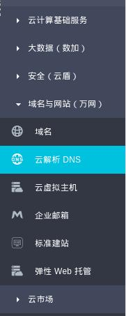
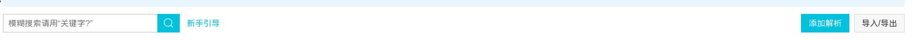
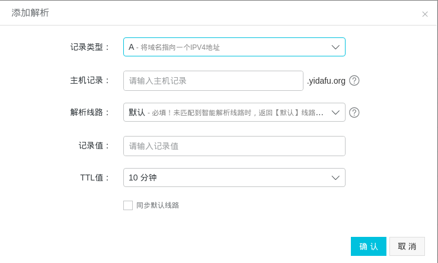
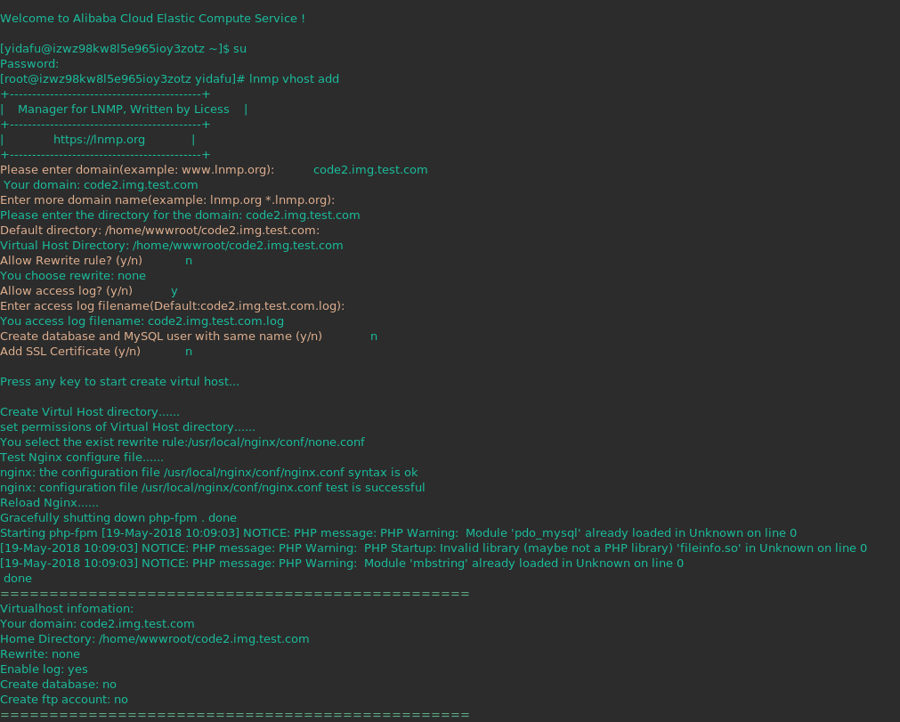

这里以部署一个`code-to-image`为例子，实例演示如何使用 Nginx 反向代理。

# 设置子域名

首先你的设置一个子域名和云解析，例如: code2img.domain.com

>code2img.test.com 只是为了演示，实际操作请换成你的域名。

我使用的阿里云



点击添加云解析



在主机记录输入子域名名。

记录值填入云服务器 IP 地址。

其余一般默认即可，点击确认。



一个子域名添加完成。

# Nginx 代理

这里我使用的 LNMP。添加一个子域名就非常简单。

执行

```shell
lnpm vhost add
```
所有选项全部默认就行。



进入`/usr/local/nginx/conf/vhost`目录

将`code2img.test.com.conf`改为一下内容

```conf
upstream dome {
        server 127.0.0.1:8080;
}
server
    {
        listen 80;
        #listen [::]:80;
        server_name code2.img.test.com ;
        index index.html index.htm index.php default.html default.htm default.php;
        root  /home/wwwroot/code2.img.test.com;

        location / {
            proxy_pass http://127.0.0.1:8080/;
            proxy_set_header Host $host;
            proxy_set_header X-Real-IP $remote_addr;
            proxy_set_header X-Forwaraed-For $proxy_add_x_forwarded_for;
        }

        include none.conf;
        #error_page   404   /404.html;

        # Deny access to PHP files in specific directory
        #location ~ /(wp-content|uploads|wp-includes|images)/.*\.php$ { deny all; }

        include enable-php.conf;

        location ~ .*\.(gif|jpg|jpeg|png|bmp|swf)$
        {
            proxy_pass http://127.0.0.1:8080;
            expires      30d;
        }

        location ~ .*\.(js|css)$
        {
            proxy_pass http://127.0.0.1:8080;
            expires      12h;
        }

        location ~ /.well-known {
            allow all;
        }

        location ~ /\.
        {
            deny all;
        }

        access_log  /home/wwwlogs/code2.img.test.com.log;
    }
```

最后重启 LNMP 就可以了。

```shell
lnmp restart
```

现在访问<https://code2img.test.com>就可以使用`code-to-img`了。

 参考
+ <http://www.nginx.cn/927.html>
+ [LNMP 添加虚拟主机](https://lnmp.org/faq/lnmp-vhost-add-howto.html)
