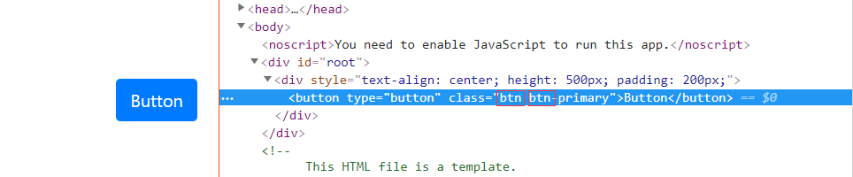
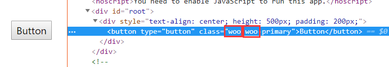
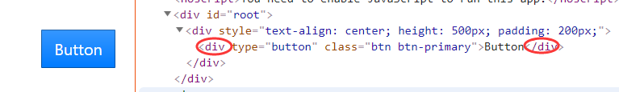
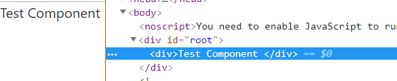

# 前言

之前一个项目有用到 React Bootstrap，现在稍微空闲下来趁这个时间读一下react-bootstrap 源码，学习一下别人是怎么写 react 组件。选择 React Bootstrap 的主要原因就是相比较于其他 UI 框架（Antd，Material-UI）， React Bootstrap 更加轻量，实现逻辑更简单，读起来会容易一些，干扰会更少。

> 我选择的版本是目前最新的`v1.0.0-beta.3`。

# 从`Button`开始

罗马不是一天建成的，阅读先从简单基础的`Button`组件开始。

源码在`src/Button.js`。

## 第三方基础包

```javasrcript
import classNames from 'classnames';
import React from 'react';
import PropTypes from 'prop-types';
import { elementType } from 'prop-types-extra';
```

第一个见过没用过，不过看名字就能猜出是干什么的。这里[classnames](https://github.com/JedWatson/classnames)地址，源代码实现非常简单，就是将`classNames(...args)`传入参经过判断展开成`classes`数组并通过`classes.join(' ')`方法合并起来。[^1]

`prop-types-extra` 顾名思义是 React Bootstrap 对 prop-types 的补充。这里主要是为了引入一个新的 `PropType` `elementType`。`elementType`实际上是一个复合类型，等价于`PropTypes.oneOf(PropTypes.string, PropTypes.element, React.Fragment)`。PropTypes里面并没有`React.Fragment`这里只是为了说明方便。

### PropType 定义

和文档里面的 API 一一对应。

```javasrcript
static propTypes = {
   bsPrefix: PropTypes.string,

   variant: PropTypes.string,

   size: PropTypes.string,

   active: PropTypes.bool,

   disabled: PropTypes.bool,

   href: PropTypes.string,

   type: PropTypes.oneOf(['button', 'reset', 'submit', null]),

   as: elementType,
 };
```

####  bsPrefix

```javasrcript
const classes = classNames(
  className, // 用户自定义的类名
  bsPrefix,
  active && 'active',
  `${bsPrefix}-${variant}`,
  block && `${bsPrefix}-block`,
  size && `${bsPrefix}-${size}`,
);
```

各类 UI 组件库为了提高组件库可扩展性，包括 Antd， Material-UI，都会提供类似的自定义类名前缀。以 Antd 的`Button`为例，它的自定义类名前缀`prop`是`prefixCls`[^2]。同样的 React Bootstrap 中也有相同作用的`prop`：`bsPrefix`，`Button`组件里默认值是：`btn`。



```jsx
<Button bsPrefix="woo">Button</Button>
```


### props 默认值。

```javasrcript
static defaultProps = {
  variant: 'primary',
  active: false,
  disabled: false,
  type: 'button',
}
```

## render 函数

render 函数的渲染逻辑比较简单，如果`props`里面有`herf`属性就返回`<SafeAnchor />`组件（<a/>标签）。

```javasrcript
if (props.href) {
  return (
    <SafeAnchor
      {...props}
      as={as}
      innerRef={innerRef}
      className={classNames(classes, props.disabled && 'disabled')}
    />
  );
}
```

没有`href` `prop`就返回一个`<button />`标签。

```
const Component = as || 'button';
if (innerRef) props.ref = innerRef;
return <Component {...props} type={type} className={classes} />;
```

这里涉及到另一个有趣的问题: `dynamic component`。

#### 动态组件

看过 React Bootstrap 文档，就知道 React-Bootstrap 的组件都有一个**`as`**属性，用来指定组件的根元素。

比如：

```jsx
<Button as="div">Button</Button>
```



上面的`<Component />`根随传入`as`的变化而变化，*Magic*！，默认是`button`。

熟悉 Vue 的话，上面的黑魔法完全不值一提。在 Vue 中内置了`<Component />`组件 [^3] [^4] [^5]，会根据`props.is`动态的生成组件。[一个官方例子](https://jsfiddle.net/chrisvfritz/o3nycadu/)

React Bootstrap 的`<Component {...props} type={type} className={classes} />`也是为了实现同样的。但 React 和 Vue 的实现机制还是不同的。从上面的 Vue 官方的例子可以看到，`props.is`可是一个自定义组件的**字符串名称**，而 React 就不可以。

```jsx
function TestComponent () {
  return <div>Test Component </div>
}
class App extends React.Component {
  render() {
    const Component = 'TestComponent'
    return (
        <Component />
    );
  }
}
```

结果会报如下错误：

```log
index.js:1446 Warning: <TestComponent /> is using incorrect casing. Use PascalCase for React components, or lowercase for HTML elements.
    in Test (at App.js:20)
    in App (at src/index.js:7)
index.js:1446 Warning: The tag <TestComponent> is unrecognized in this browser. If you meant to render a React component, start its name with an uppercase letter.
    in Test (at App.js:20)
    in App (at src/index.js:7)
```

众所周知 JSX 是一种语法糖，所以`<Component />`会被编译成`React.createElement(Component, ...)`, 而`Component = 'TestComponent'`,也就是React.createElement('TestComponent', ...)`[^6]。

`React.createElement()`的一个参数可以是：字符串，React 组件，React Fragment（这就是是`prop-types-extra`里面的`elementType`），如果`React.createElement()`的第一个参数是字符串，那么它就必须是合法的 HTML 标签[^7]。显然`<TestComponent />`不是什么合法的 HTML 标签，也就无法被浏览器识别（The tag <TestComponent> is unrecognized in this browser）。但是，也不是没有变通的方法[^8]，`Component`变量被赋值字符串不行，那赋值为一个 React 组件呢？

```jsx
function TestComponent () {
  return <div>Test Component </div>
}
class App extends React.Component {
  render() {
    const Component = TestComponent
    return (
        <Component />
    );
  }
}
```



Good!

## `createBootstrapComponent()`

最后导出`Button`组件是并不是直接导出，而出通过`createBootstrapComponent()`函数包装后再导出。

```js
export default createBootstrapComponent(Button, {
  prefix: 'btn',
  forwardRefAs: 'innerRef',
});
```
使用`createBootstrapComponent()`函数给组件包装了一层`<Consumer />`，配合`<ThemeProvider />`就可以批量修改`bsPrefix`。[^9]

# 总结

总的来说 React Bootstrap 的实现还是比较简单，读起来也不是很吃力，从中也可以学到许多写组件的规范和技巧。

[^1]:https://github.com/JedWatson/classnames/blob/2c76e87c4afdc7f6ceec5e10c0b9dba08cb4dcbb/index.js#L38
[^2]: https://github.com/ant-design/ant-design/blob/75e30e2555818c0347a014df34c5de9552741463/components/button/button.tsx#L55
[^3]: https://vuejs.org/v2/api/#component
[^4]: https://vuejs.org/v2/guide/components.html#Dynamic-Components
[^5]: https://vuejs.org/v2/guide/components-dynamic-async.html
[^6]: https://stackoverflow.com/questions/29875869/react-jsx-dynamic-component-name
[^7]: https://reactjs.org/docs/react-api.html#createelement
[^8]: https://reactjs.org/docs/jsx-in-depth.html#choosing-the-type-at-runtime
[^9]: https://react-bootstrap.netlify.com/getting-started/theming/#custom-styles-prefix
