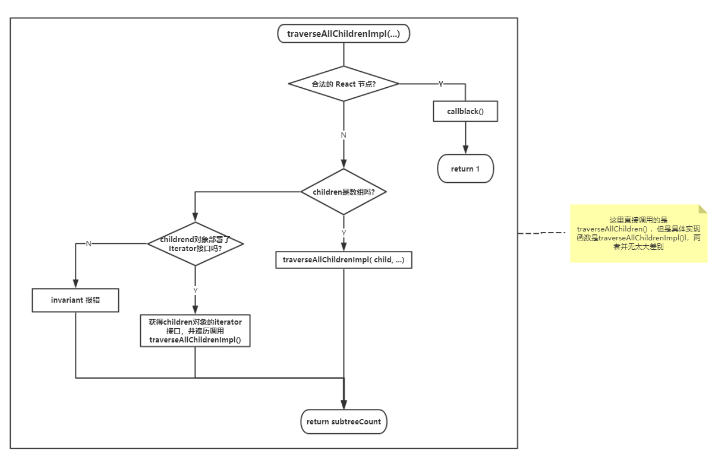

# React.Children

`React.Children`[^1]有`map`,`forEach`,`count`,`toAarry`,`only`五个方法。其中`map`,`forEach`,`count`,`toArray`实现基本相同都调用了`traverseAllChildren`函数，只是传入的参数稍有不同，后面以`map`为例详细说明,其它函数穿插其中讲解。`only`方法实现比较简单。

## React.Children.map

官方的函数签名：[^2]:

```js
React.Children.map(children, function[(thisArg)])
```

### React.Children.map 粗略一瞥

`packages/react/src/ReactChildren.js`

`React.Children.map`是`mapChildren`的别名。

```js
function mapChildren(children, func, context) {
  if (children == null) {
    return children;
  }
  const result = [];

  mapIntoWithKeyPrefixInternal(children, result, null, func, context);
  return result;
}
```

这里就是判断一下`children`是否为`null`，如果是就直接返回`children`. 声明一个`reuslt`数组用来存放`map`需要返回的值, 有点 C 的味道: 通过传入一个参数来带回结果.

看一下`mapIntoWithKeyPrefixInternal`函数：

```js
function mapIntoWithKeyPrefixInternal(children, array, prefix, func, context) {
  let escapedPrefix = '';
  if (prefix != null) {
    escapedPrefix = escapeUserProvidedKey(prefix) + '/';
  }
  const traverseContext = getPooledTraverseContext(
    array,
    escapedPrefix,
    func,
    context,
  );
  // `traverseAllChildren` 在这里是一个通用函数, `forEach`,`count`,`toAarry`
  // 的实现都是通过这个函数实现的
  traverseAllChildren(children, mapSingleChildIntoContext, traverseContext);
  releaseTraverseContext(traverseContext);
}
```

首先是`getPooledTraverseContext(...)`函数,它返回一个`traverseContext`对象. 这个`traverseContext`对象将在后面的遍历中发挥重要作用.

```js
{
  result, // 最后`map`函数返回的结果数组,对于`forEach`函数这个参数被设为了`null`
  keyPrefix, // 遍历到的 React Node 节点的 key
  func, // 用户定义的回调函数,`map`函数的第一个参数
  context, // 用户定义的 thisArg 对象,`map`函数的第二个参数
  count: 0, // 子节点数,`count`函数的结果值就是从这里来的
}
```

先看一下最后一行的

```js
releaseTraverseContext(traverseContext)
```

根据函数名,可以得知它的作用就是释放`traverseContext`对象.它的功能实现也确实是这样,不过他还多做了一件事就是将 release 掉的的`traverseContext`放到一个`traverseContextPool`里面.

### `traverseAllChildren` 包装

`traverseAllChildren(...)`函数来实现了具体的遍历逻辑. 但`traverseAllChildren()`并没有做具体的实现,而是调用了`traverseAllChildrenImpl(...)`.

```js
function traverseAllChildren(children, callback, traverseContext) {
  if (children == null) {
    return 0;
  }

  return traverseAllChildrenImpl(children, '', callback, traverseContext);
}
```

`traverseAllChildrenImpl()`函数的签名是:

```js
function traverseAllChildrenImpl(
  children, // 被遍历的子树
  nameSoFar, // `props.key`的累计值
  callback, // 每个节点的回调函数, 这里还并不是用户传入的那个回调函数
  traverseContext, // 就是上面`getPooledTraverseContext()`创建的`context`
)
```

为什么要分成两个差不多的函数呢? 因为`traverseAllChildrenImpl()`内部发生了递归调用. `traverseAllChildrenImpl()`的参数里面多了一个`nameSoFar`, 它用来产生新 React node 对象的`key`, 递归的过程中每次调用时`nameSoFar`的值都不同的.这么做就是为了简化函数调用,调用`traverseAllChildren()`是不必传入一个默认的`''`空串.

#### 返回值

`traverseAllChildrenImpl()` 的返回值是`number`,即`children`的子树数量.

对于`React.Children.count`, 其实现就是调用并返回`traverseAllChildren()`函数的结果值.

```js
function countChildren(children) {
  return traverseAllChildren(children, () => null, null);
  ↓   ↓   ↓   ↓   ↓   ↓   ↓   ↓   ↓   ↓   ↓   ↓   ↓   ↓
  return traverseAllChildrenImpl(children, '', () => null, null)
}
```

`React.Children.count`调用`traverseAllChildren()`就是调用了`traverseAllChildrenImpl()`. 但是在调用时除了第一个参数`children`其余都被设为了空. 所以在遍历过程中`traverseAllChildrenImpl()`依然触发回调,但不会产生任何作用.

### 遍历逻辑



`traverseAllChildrenImpl()`流程就是判断是否是合法的 React 节点? 是, 调用`callback()`返回节点数1. 否, 则判断是否是 React 节点数组或者部署了`interator`接口没, 即`children`是否是可以**遍历**的? 是, 遍历每个元素调用`traverseAllChildrenImpl()`. 否则,就报错. 最后再返回子节点数.

### 回调函数

上面提到对于合法的 React 节点调用回调函数, 但这里的回调函数并不是用户传进来的, 而是针对`map`或`forEach`操作定制的一个函数.

上面`mapIntoWithKeyPrefixInternal`函数

```js
traverseAllChildren(children, mapSingleChildIntoContext, traverseContext);
```

`forEach`的实现代码:

```js
function forEachChildren(children, forEachFunc, forEachContext) {
  if (children == null) {
    return children;
  }
  const traverseContext = getPooledTraverseContext(
    null,
    null,
    forEachFunc,
    forEachContext,
  );
  traverseAllChildren(children, forEachSingleChild, traverseContext);
  releaseTraverseContext(traverseContext);
}
```

`getPooledTraverseContext`函数签名:

```js
function getPooledTraverseContext(
  mapResult, // `map`操作返回的结果存放处
  keyPrefix, // 给`props.key`准备的
  mapFunction, // 这里才是传经来的 callback, `map`,`forEach`的第一个参数
  mapContext, // 这个是 `thisArg`, `map`,`forEach`的第而个参数
)
```

`map`函数传入的`callback`函数是`mapSingleChildIntoContext`,而`forEach`则是`forEachSingleChild`, 并且调用`getPooledTraverseContext()`少传入了`mapResult`,`keyPrefix`两个参数. 这就是应为`forEach`操作不需要返回值,也就没有用一个数组返回存放返回值,也不需要给每个要返回的 React 节点设置`key`, 自然`keyPrefix`这个参数也可以掉.

`forEach`的`forEachSingleChild`实现就比较简单的,就是通过`func.call(...)`调用使用者传入的函数.

```js
function forEachSingleChild(bookKeeping, child, name) {
  const {func, context} = bookKeeping;
  func.call(context, child, bookKeeping.count++);
}
```

`bookKeeping`对象就是前面的`traverseContext`对象.


相比而言`map`的`mapSingleChildIntoContext`就复杂一点了

```js
function mapSingleChildIntoContext(bookKeeping, child, childKey) {
  const {result, keyPrefix, func, context} = bookKeeping;
  let mappedChild = func.call(context, child, bookKeeping.count++);
  if (Array.isArray(mappedChild)) {
    mapIntoWithKeyPrefixInternal(mappedChild, result, childKey, c => c);
  } else if (mappedChild != null) {
    if (isValidElement(mappedChild)) {
      mappedChild = cloneAndReplaceKey(
        mappedChild,
        // Keep both the (mapped) and old keys if they differ, just as
        // traverseAllChildren used to do for objects as children
        keyPrefix +
          (mappedChild.key && (!child || child.key !== mappedChild.key)
            ? escapeUserProvidedKey(mappedChild.key) + '/'
            : '') +
          childKey,
      );
    }
    result.push(mappedChild);
  }
}
```

首先还是调用用户传入的`callback`,传入`this`对象`context`,`child`节点和索引值, 就会得到一个`mappedChild`的返回值. 不同于这里有不同于原生`map`函数的地方: 先判断返回的`mappedChild`是不是数组, 是的就执行:

````js
mapIntoWithKeyPrefixInternal(mappedChild, result, childKey, c => c)
````

否则,就`push`进入`result`里面.

### 遍历的深度


有一个有意思的问题:

```jsx
React.Children.count(
  (
    <div>
      <div class="nest">
        0001
        <div>0002</div>
        <div>
          0003
          <div>0004</div>
        </div>
      </div>
    </div>
  ).props.children,
  child => child.props.children
),
```

上面的代码会出现递归吗?`return c.props.children`会使得`if (Array.isArray(mappedChild))`始终为`true`,那么会发生类似递归的事情吗?

不会!

注意到了没?

```js
// mapSingleChildIntoContext
mapIntoWithKeyPrefixInternal(mappedChild, result, childKey, c => c);
//                                                          ↑ ↑ ↑
// mapChildren                                              ↓ ↓ ↓
mapIntoWithKeyPrefixInternal(children,    result,  null,    func, context)
```

当用户在`React.Children.map`里面返回`child.props.children`,再次被遍历时实际上被调用的`map`回调就不再是`child => child.props.children`,变成了`c => c`, 也就不存在递归遍历的问题.

这里和`React.Children.toArray`的实现时基本一样的,不过多了一个返回值.


```js
function toArray(children) {
  const result = [];
  mapIntoWithKeyPrefixInternal(children, result, null, child => child);
  return result;
}
```
### traverseContextPool

`getPooledTraverseContext()`函数里有个有意思的地方, React 用了`traverseContextPool`数组来保存`traverseContext`.但是有点难以理解为什么要这么做呢?

```js
const POOL_SIZE = 10;
const traverseContextPool = [];

function getPooledTraverseContext(
  mapResult,
  keyPrefix,
  mapFunction,
  mapContext,
) {
  if (traverseContextPool.length) {
    const traverseContext = traverseContextPool.pop();
    traverseContext.result = mapResult;
    traverseContext.keyPrefix = keyPrefix;
    traverseContext.func = mapFunction;
    traverseContext.context = mapContext;
    traverseContext.count = 0;
    return traverseContext;
  } else {
    return {
      result: mapResult,
      keyPrefix: keyPrefix,
      func: mapFunction,
      context: mapContext,
      count: 0,
    };
  }
}
function releaseTraverseContext(traverseContext) {
  traverseContext.result = null;
  traverseContext.keyPrefix = null;
  traverseContext.func = null;
  traverseContext.context = null;
  traverseContext.count = 0;
  if (traverseContextPool.length < POOL_SIZE) {
    traverseContextPool.push(traverseContext);
  }
}
```

```jsx
React.Children.map(
  (
    <div>
      <div class="pre">
        <div>pre div 1</div>
        <div>pre div 2</div>
      </div>
      <div>
        0001
      </div>
      <div class="post">
        <div>post div 1</div>
        <div>post div 2</div>
      </div>
    </div>
  ).props.children, c => c.props.children
)
```

这里是因为,就像上面说到的当你在`React.Children.map`中返回的 React 节点是数组时就会再次调用`mapIntoWithKeyPrefixInternal(mappedChild, result, childKey, c => c)`

比如上面的遍历的第一个`<div class="pre">...</div>`,这时返回的children数组`<div>pre div 1</div><div>pre div 2</div>`,调用了`mapIntoWithKeyPrefixInternal(...)`, `mapIntoWithKeyPrefixInternal(...)`又会调用`getPooledTraverseContext()`返回一个新的 `traverseContext`.当`<div>pre div 1</div><div>pre div 2</div>`遍历完了就会`releaseTraverseContext(traverseContext)`,把`traverseContext`压入`traverseContextPool`.

遍历第二个`<div>0001</div>`,这里使用`traverseContext`是最开始创建那个,这个还没有被压入`traverseContextPool`.

遍历第三个`<div class="post">...</div>`的时候就就和第一个就比较类似了,不过这是调用`getPooledTraverseContext()`时,因为`traverseContextPool.length === 1`会从`traverseContextPool`中弹出第一个`<div class="pre">...</div>`使用过的`traverseContextPool`重新赋值.

最后三个`<div />`都遍历完了以后把最开始创建的`traverseContext`也压入`traverseContextPool`中.

## 历史变动

为了使得逻辑有更好的重新性, React 在 [#10227](https://github.com/facebook/react/pull/10227) 删除了原来的`PooledClass`, 将所有`PooledCall`的逻辑移到`ReactChildren.js`,变成`traverseContextPool`数组.这个变动是的`ReactChildren`与其他模块的依赖变少了,代码也变得更加简洁了

[^1]: https://reactjs.org/docs/react-api.html#reactchildren
[^2]: https://reactjs.org/docs/react-api.html#reactchildrenmap