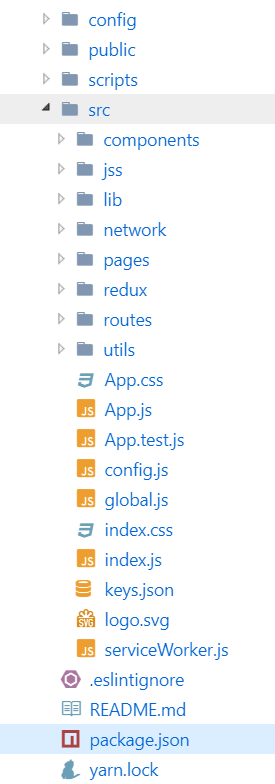

# 开发环境

## 编辑器

vs code

### 插件列表

+ atom keymap
+ auto close tag
+ auto rename tag
+ beautify
+ bracket pair colorizer
+ editorconfig for vs code
+ eggjs
+ es7 React/Redux/GraphQL/React Native snippets
+ eslint
+ gitlens
+ js refactor
+ node.js extension pack
+ npm
+ npm intellisense
+ path intellisense
+ React PropTypes intellisense
+ Search node_modules
  
## node

node.js 版本 v10.14.1

## 脚手架

create-react-app

## package.json

### 主要依赖

+ axios HTTP 请求
+ eslint
+ jest 测试框架
+ moment 日期处理
+ react
+ react-dom
+ react-jss css in js
+ react-bootstrap UI 库
+ react-datepicker 日期选择器
+ react-redux 状态管理
+ react-router-bootstrap
+ redux-saga 异步请求解决方案

### cli

+ start 项目启动(开发模式)
+ build 构建项目
+ test 单元测试
+ lint 代码风格检查


启动项目流程

```shell
# 1.clone
https://github.com/dov-yih/speech-registration.git
cd path/to/repo-dir/packages/frontend

# 2.install dependence
yarn

# 3. run project
yarn start
```
## 目录结构



# 主要技术介绍

## 路由

### 路由分离

为了避免路由的耦合.路由通过路由`route`文件注入.

`pages/index.jsx`

```jsx
<Switch>
  {
    IndexRoutes.map(
      ({path,exact,component},idx) => (
        <Route
          key={idx}
          path={path}
          exact={exact}
          component={component}
        />
      )
    )
  }
  <Route component={NotFound} />
</Switch>
```

`IndexRoutes`来自于`route/index.js`

```js
export default [{
  path: '/next',
  exact: true,
  name: '下一周',
  component: Next,
}, {
  path: '/archives',
  exact: true,
  name: '归档',
  component: Archive,
}, {
  path: '/login',
  exact: true,
  name: '登陆',
  component: Login,
}, {
  path: '/',
  exact: true,
  name: '首页',
  component: Home,
}]
```

### 正则匹配

有个需求要求这个能够匹配`/16012345`这样的路由,经过重重查询终于找到了解决方案.

```jsx
<Route
  path={`/:school_number(${SCHOOL_NUMBER_REGEXP_STR})`} 
  component={Admin}
/>

SCHOOL_NUMBER_REGEXP_STR = '[12][0-9]{7,7}'
```

### 私有路由

因为`/admin/*`只有登录以后才可一个访问所以需要在前端做权限控制。

使用`redux`保存全局的登记状态只有`isLogin`为`true`才可以访问.

```jsx
class AdminIndex extends Component {
  render() {
    const {isLogin} = this.props
    return (
      <Row>
       //...
        <Col md={8} mdOffset={1}>
          {isLogin
            ? routes.map(
              ({ path, exact, component }, idx) => (
                <Route
                  key={idx}
                  path={url + path}
                  exact={exact}
                  component={component}
                />
              ))
            : <Redirect to="/login" />
          }
        </Col>
      </Row>
    )
  }
}
export default connect(state => {
  const { user: isLogin } = state
  return { isLogin }
})(AdminIndex)
```

实际上这里可以再封装成一个`PrivateRoute`组件

```jsx
class PrivateRoute extends Component {
  render() {
    const {isLogin,path, exact, component} = this.props
    if(isLogin) {
      return (
        <Route
          key={idx}
          path={url + path}
          exact={exact}
          component={component}
        />
      )
    }
    return <Redirect to="/login" />
  }
}
export default connect(state => (
  {isLogin: state.user.isLogin}
))(PrivateRoute)
```

## 登陆

加密库使用的是`jsencrypt`

为了将来易于修改学号,密码的验证规则,学号密码的正则表达式统一的放在了`@/global`里面

```js
export const SCHOOL_NUMBER_RULE = /^[12][0-9]{7,7}$/

export const PASSWORD_RULE = /^[0-9a-zA-Z!@#$%^&*_=+]{6,20}$/
```

```js
submit = async () => {
  // ...
  const { sNo, password } = this.state

  let sign = new JSEncrypt()
  sign.setPublicKey(PUBLIC_KEY)

  // 加密密码
  let encryptedPasswd = sign.encrypt(password)
  
  // login request

  return true
}
```

## 登录框的垂直居中问题

关于垂直居中,参考 EasyMock 实现的.核心代码如下:

```css
.parent {
  width: 300px ;
  height: 300px;
  position: relative;
}
.child {
  position: absolute;
  top: 0; 
  right: 0;
  bottom: 0;
  left: 0;
  width: 100px;
  height: 100px;
  margin: auto;
}
```

这个问题如果使用`flex`就很好解决.只要将`align-item`和`justify-content`设为`center`就可以满足要求。

## 请求库

请求库使用的自己封装的`resource-oriented-request`

`network/base.js`

```js
import API,{baseURL} from 'resource-oriented-request'

export default
@baseURL('http://localhost:7001')
class Base extends API { }
```

`network/admin.js`

```js
import Base from './base'
// ..
export default class Admin extends Base {
  static prefix = '/admin'

  static headers = {
    authorization: 'Bearer ' + state.user.token
  }
}
```

使用:

```js
Admin.get(params)

Admin.post(data)
```

# 遇到的问题

## link tags 位置不正确


参考链接:


+ https://github.com/cssinjs/react-jss/issues/127
+ http://cssinjs.org/setup/?v=v8.1.0#specify-dom-insertion-point
+ https://stackoverflow.com/questions/46916402/how-to-add-visible-html-comment-in-jsx

这个问题还是因为 react-jss 插入的`style`标签的顺序在`link`标签之前.

解决方法

直接在 `public/index.html`插入`link`标签

## \<Link/>与\<MenuItem>的冲突

因为`react-bootstrap`的`<MenuItem/>`会被渲染成`<a/>`标签,和`react-router`的`<Link />`组件冲突.两者都会被渲染成`<a />`冗余了,不用`<Link/>`组件做跳转的话很显然非常糟糕的.所幸,`react-bootstrap`提供了一个解决方案`react-router-bootstrap`

```jsx
import {LinkContainer} from 'react-router-bootstrap'
// ...
<LinkContainer to="/speech">
  <MenuItem eventKey={3.1}>记录</MenuItem>
</LinkContainer>
```