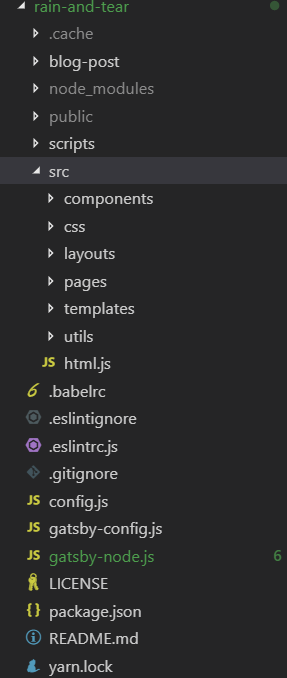

# 动机

现在流行的静态博客生成器不少,比如: Hexo, Jekyll.但是,我想要一个写作和生成分离的静态生成器,所以就有了这个项目.另一个原因就是想做一个项目折腾一下.

## `Gatsby`

`Gatsby`是目前最流行的`React`静态网站生成器.建立在`React`强大的生态,`graphq`技术之上.

项目从最简单的 hellow word start: `gatsby-starter-hello-world`开始开发.

项目目录如下:



## 实现的功能

+ [x] 首页文章列表
+ [x] 文章分页
+ [x] 分类
+ [x] 标签
+ [x] 归档
+ [x] 代码高亮

## 文章格式约定

```
---
title: 基于 Gatsby 的静态博客生成 
date: '2019-01-04'
tags:
  - react
  - gatsby
  - generator
category: frontend
---

// context
```

## 文章列表

参考:gatsby-graphql-qurey[^1]

```jsx

// @NOTE http://es6.ruanyifeng.com/#docs/string#标签模板
export const query = graphql`
  query {
    allMarkdownRemark(
      // 排序方式: 按日期降序
      sort: {
        fields: [frontmatter___date], 
        order: DESC
      }
      filter: {
        fields: {
          // 去掉没有分类的
          category: {
            ne: "Null"
          }
        }
      }
      // 首页展示 10 条
      limit: 10
    ) {
      // 文章总数,给分页器的
      totalCount
      edges {
        // 具体的文章简略信息
        node {
          id
          frontmatter {
            title
            date(formatString: "DD MMMM, YYYY")
          }
          fields {
            slug
            category
          }
          excerpt
        }
      }
    }
  }
`
```

这有个点`/index`和`/post`实际展示的同样的内容,`/ == /post`.

## 文章内容页

主要就是遍历`edges`数组,对每个`edge`调用一次`createPaqge`.

这里不一样的地方就是`edges`用`previous`和`next`两个字段,其值是`前一页和后一页的链接.
```js
edges.forEach(({
  node,
  next,
  previous
}) => {
  const preSlug = previous ? previous.fields.slug : ''
  const nextSlug = next ? next.fields.slug : ''
  // 创建文章内容页
  createPage({
    path: node.fields.slug,
    component: path.resolve('./src/templates/BlogPost.jsx'),
    context: {
      slug: node.fields.slug,
      pre: preSlug,
      next: nextSlug,
      tags: uniqTags
    },
  })
})
```
## 文章分页

实现文章分页,引入的`gatsby-paginate`插件.这个插件主要的做的事情就是根据传入`pageLenght`把`edges`数组分割,在调用`createPage`函数创建页面.

```js
createPaginatedPages({
  edges: edges,
  createPage: createPage,
  pageTemplate: path.resolve('./src/templates/MainPagination.jsx'),
  pageLength: 10,
  pathPrefix: 'posts',
  context: {
    totalCount: totalCount,
    tags: uniqTags,
  }
})
```

## 分类

相比于标签,分类更简单一些.分类就是:`1<-->n`,而标签则是:`n<-->n`

思路就是,把每篇文章的分类取出来,对相同的分类进行合并.

```js
// 按照分类分组
let categories = _.groupBy( edges, 'node.fields.category')
Object.keys(categories).forEach(categoryName => {
  // 取出统一分类所有文章
  let edegs = categories[categoryName]
  // 创建分页
  createPaginatedPages({
    edges: edegs,
    createPage: createPage,
    pageTemplate: path.resolve('./src/templates/MainPagination.jsx'),
    pageLength: 10,
    pathPrefix: `categories/${categoryName}`,
    context: {
      totalCount: edegs.length,
      category: categoryName,
    }
  })
})
```

## 标签

```js
// 第一步：找到所有的 Tags
let tags = edges
  // 去掉所有是 null 的tags
  .filter( (edge) => edge.node.frontmatter.tags !== null)
  // 所有返回的 tag 和 node.frontmatter.tags 变为小写
  .map(edge => edge.node.frontmatter.tags.map((tag,idx,arr) => arr[idx] = tag.toLowerCase()))

// 第二步：把 Tags 平坦化，去重
tags = _.flatten(tags) // 平坦的 tags
let uniqTags = _.uniqWith( // 去重
  tags,
  (one, anther) => one === anther
)
// 第三步：把数据结构转变为： [ {tag: string, nodes: [node,node]} ]
let TagNodes = []
uniqTags.forEach(tag => {
  let tagGroup = edges.filter(edge => {
    if (edge.node.frontmatter.tags && edge.node.frontmatter.tags.includes(tag)) {
      return edge.node
    }
  })
  TagNodes.push({ tag: tag, nodes: tagGroup })
})

// 第四步：创建页面
TagNodes.forEach(tagNode => {
  createPaginatedPages({
    edges: tagNode.nodes,
    createPage: createPage,
    pageTemplate: path.resolve('./src/templates/MainPagination.jsx'),
    pageLength: 10,
    pathPrefix: `tags/${tagNode.tag}`,
    context: {
      totalCount: tagNode.nodes.length,
      tags: uniqTags,
    }
  })
})
```

## 归档

归档和前面的分类类似,不过是按照日期分组.

```js
let archives = _.groupBy(edges, function(edge) {
  // 按照 YYYY/MM 分组
  let postCreatedAt = new Date(edge.node.frontmatter.date)
  return postCreatedAt.getFullYear() + '/' + postCreatedAt.getMonth()
})
// 同分类实现
Object.keys(archives).forEach(date => {
  let edegs = archives[date]
  createPaginatedPages({
    edges: edegs,
    createPage: createPage,
    pageTemplate: path.resolve('./src/templates/MainPagination.jsx'),
    pageLength: 10,
    pathPrefix: `archives/${date}`,
    context: {
      totalCount: edegs.length,
      date,
    }
  })
})
```

## 代码高亮

代码高亮是手动实现的.实际上有代码高亮的插件,同样是基于`prismjs`.

把代码高亮的逻辑封装成了一个函数`str2codeblock`.

就是取出`/<pre><code class="language-(.*?)">([\s\S]+?)<\/code><\/pre>/g`匹配的字符串,调用`Prism.highlight`函数进行高亮转换,最后返回就可以了.

```js
export default (rawCodString) => {
  // @see https://segmentfault.com/a/1190000002640851
  // @see https://blog.csdn.net/lxcnn/article/details/4756030
  return rawCodString.replace(/<pre><code class="language-(.*?)">([\s\S]+?)<\/code><\/pre>/g, 
    (match,p1,p2) => {
      // @FixME Prism 不支持 Shell 的语法高亮
      p1 = loadPrismLanguage(p1) ? p1 : 'html'

      const codeBlock = Prism.highlight( p2, Prism.languages[p1], p1)
      return `<pre class="language-${p1}"><code class="language-${p1}">${codeBlock}</code></pre>`
    })
}
```

在展示文章内容是在调用这个函数即可.

```jsx
render() {
  let { html } = this.props
  html = str2CodeBlack(html)
  return (
    <div dangerouslySetInnerHTML={{ __html: html }}  >
    </div>
  )
}
```

# 总结

上面简单描述了一下涉及到的博客数据的处理,在 Gatsby 的帮助先很多步骤变得简单很多.而且 Gastby 的生态也越来越丰富,很多的功能都有相应的插件.

[^1]: https://www.gatsbyjs.org/tutorial/part-four/#your-first-graphql-query