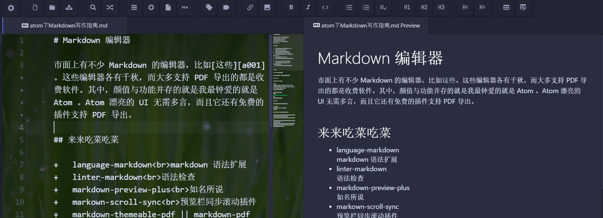

市面上有不少 Markdown 的编辑器，比如[这些][a001]。这些编辑器各有千秋，而大多支持 PDF 导出的都是收费软件。其中，颜值与功能并存的就是我最钟爱的就是 Atom 。Atom 漂亮的 UI 无需多言，而且它还有免费的插件支持 PDF 导出。

# 来来吃菜吃菜

+   language-markdown<br>markdown 语法扩展
+   linter-markdown<br>语法检查
+   markdown-preview-plus<br>如名所说
+   markown-scroll-sync<br>预览栏同步滚动插件
+   markdown-themeable-pdf || markdown-pdf <br>PDF 转化插件
+   pdf-view<br>atom 里面查看 PDF
+   tool-bar-markdown-writer<br>Markdown 工具栏
+   markdown-table-format<br>表格格式化工具
+   Markdown-Writer<br>一系列增强功能，可同步静态博客，如：jekyll，hexo
+   markdown-img-paste<br>直接使用`ctrl+v`粘贴图片

# 不要客气

### linter-markdown

linter-markdown 需要预先安装`linter`基础插件。

### PDF 转换

**这个插件要求 Node 环境。**

可能有报错：
>AssertionError: html-pdf: Failed to load PhantomJS module. You have to set the path to the PhantomJS binary using 'options.phantomPath'

打开命令行在**当前家目录**下执行
```sh
npm install phantomjs-prebuilt
```
如果被墙了[可以参考这里][a003]

### 工具栏

这个插件依赖于`tool-bar-main`，需要预先安装。

# 来来再添一碗饭
安装之前应该保证有 node 环境，和 VC++。[参考][a004]

# 效果预览



[这里有更多有趣的插件。][a002] [客服热线][a005]

[a001]:https://github.com/wizardforcel/markdown-simple-world/blob/master/1.md
[a002]:https://github.com/kompasim/atom-plugins
[a003]:http://blog.csdn.net/dream_an/article/details/51800523
[a004]:https://github.com/atom/atom/blob/1.18-releases/docs/build-instructions/windows.md
[a005]:http://baidu.com
