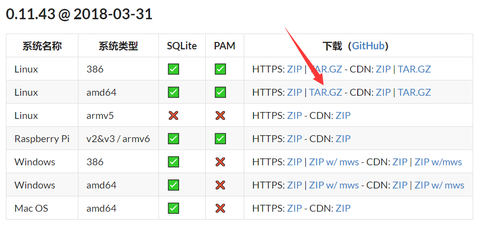
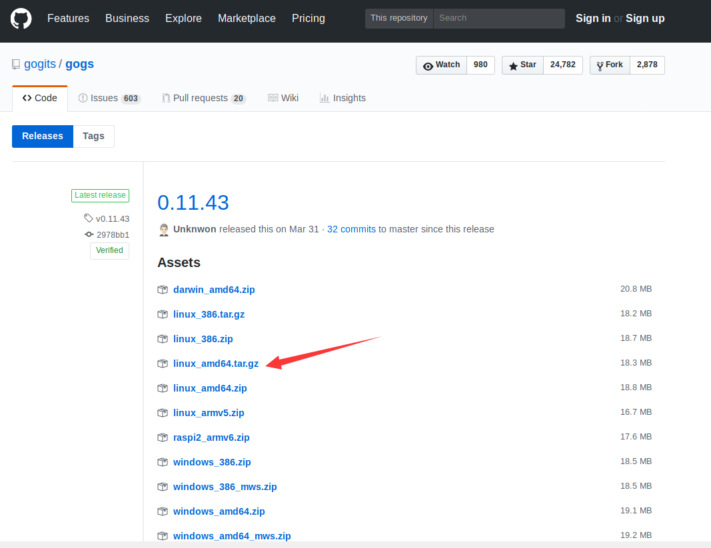
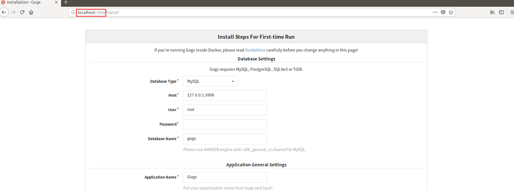
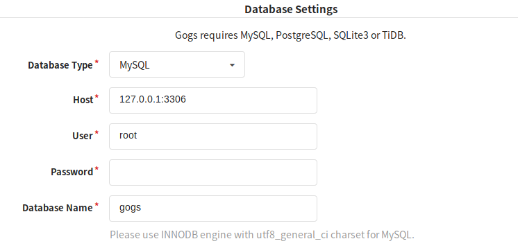
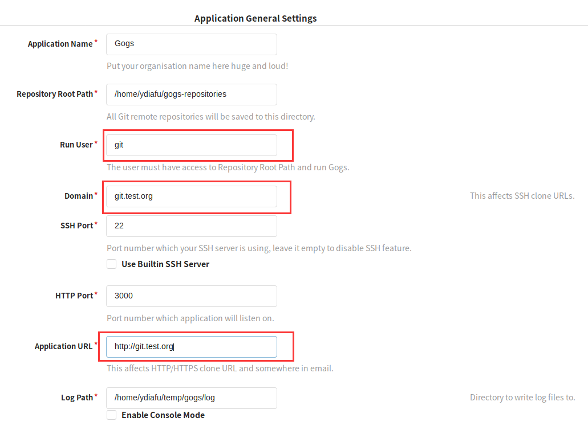
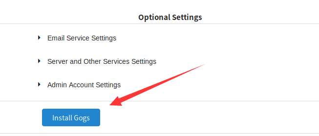
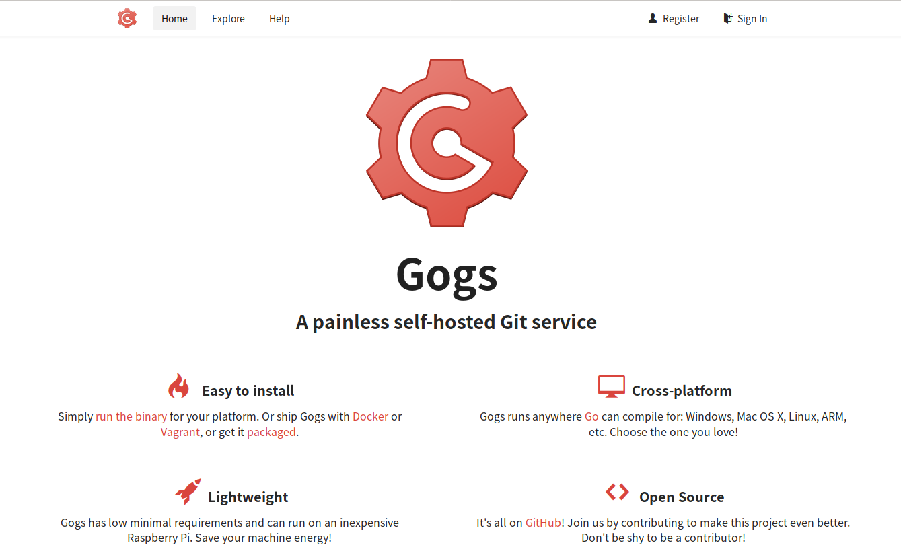

# 基于Gogs的自主git服务

gogs 的优点：安装简单，配置要求小。

>操作建议:查看最新的官方英文安装文档

## 新建一个`git`用户

```shell
sudo useradd git
```

如果你不想折腾，这一步就非常重要了。原因是后面需要选择一个用户作为*运行用户*，如果你不添加`git`用户的话，你就会选择`root`作为 Gogs 的运行用户（理所当然不是吗？）。然后，一切搞好断开 SSH 连接以后，你会发现`root`用户无法登录，如果你只有一个`root`用户的话，**恭喜你系统重装了解一下**，开玩笑啦( • ̀ω•́ )✧。别慌张，你只要重启一下服务器就可以解决，其主要目的是为了杀死正在运行的 Gogs 进程，你有另外的方法也可以。

## 获得发行包

进入 git 用户目录。

```shell
cd /home/git
```

获得安装包。请到官网选择最新的发行版。

```shell
wget https://dl.gogs.io/0.11.43/gogs_0.11.43_linux_amd64.tar.gz
```



你也可以到官方的 github 仓库去获取最新版本。地址是这个：<https://github.com/gogits/gogs/releases>



解压

```shell
tar -zxvf gogs_0.11.43_linux_amd64.tar.gz
```

## 安装

进入解压好的目录

```shell
cd gogs_0.11.43_linux_amd64.tar.gz
```

```shell
./gogs web
```

访问<http://your-ip:3000>即可进入图形化安装界面。


到这一步请务必确保`3000`端口是可以访问的。强烈建议先参考[这里](#port)



这里我是虚拟机演示的，实际操作请使用你的 IP:3000 访问

配置数据库：

你需要输入的是你的数据库用户名和密码。注意：你的数据库需要自己手动创建, Gogs 不会替你创建数据库，建议数据名为`gogs`



应用配置：

到这一步特别重要的是运行用户的设置，域名的设置。

**记住：将谁设为运行用户以后就不能通过 SSH 登录了，如果你只有一个`root`用户请务必先添加一个`git`用户**这是 Gogs 处于安全性考虑而设计的。如果出现了`root`用户登录失败，也是有方法的，参见 [Trouble Sheet](#sheet)。

至于为什么要将域名设置好？这关系着你使用`git clone url`时，URL 是否美观，如果你不介意通过使用这样的命令：`git clone git@127.0.0.1:3000/usr-name/repo`这样丑陋的命令，这两个使用默认就可以了选项默认。如果你想要通过域名访问的话，就需要配置 Nginx 反向代理，相关内容参考[这里](#nginx)



最后点击安装。



一切顺利的你就可以安装好了你的 git 自助服务。

访问<http://your-ip:3000>



恭喜你！安装结束！

是不是很方便？赶快去享受你的自建 git。

>第一个注册的用户默认为管理员

## Trouble Sheet

### 如何后台运行

方法很多,我使用的`screen`。

```shell
cd gogs/

screen -S gogs

./gogs web
```

关闭 SSH 链接，依旧运行。

### <span id="port" >云服务器开放端口</span>

+ <https://help.aliyun.com/document_detail/25471.html>

### <span id="nginx">Nginx 反向代理</span>

+ [Nginx 反向代理](../PHP/Nginx反向代理.md)

### 不小心用root权限install,现在root无法远程登录ssh怎么破?

[Run as root and cannot login with SSH](https://github.com/gogits/gogs/issues/349)
